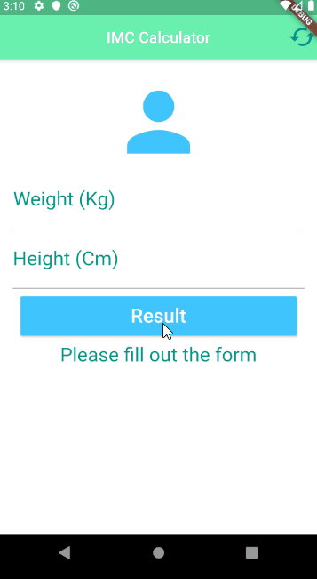

# IMC Calculator :muscle:

This is my second project with Flutter.
Ps: IMC, Indice de Massa Corporal from Portuguese = BMI, Body Mass Index.

| Category - BMI                        | FROM | TO   |
|---------------------------------------|------|------|
| Very severely underweight             | 0    | 15   |
| Severely underweight                  | 15   | 16   |
| Underweight                           | 16   | 18.5 |
| Normal (healthy weight)               | 18.5 | 25   |
| Overweight                            | 25   | 30   |
| Obese Class I (Moderately obese)      | 30   | 35   |
| Obese Class II (Severely obese)       | 35   | 40   |
| Obese Class III (Very severely obese) | 40   | 45   |
| Obese Class IV (Morbidly obese)       | 45   | 50   |
| Obese Class V (Super obese)           | 50   | 60   |
| Obese Class VI (Hyper obese)          | 60   | +60  |

### Demonstration :computer:

